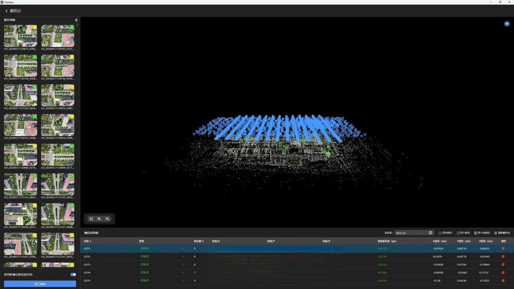
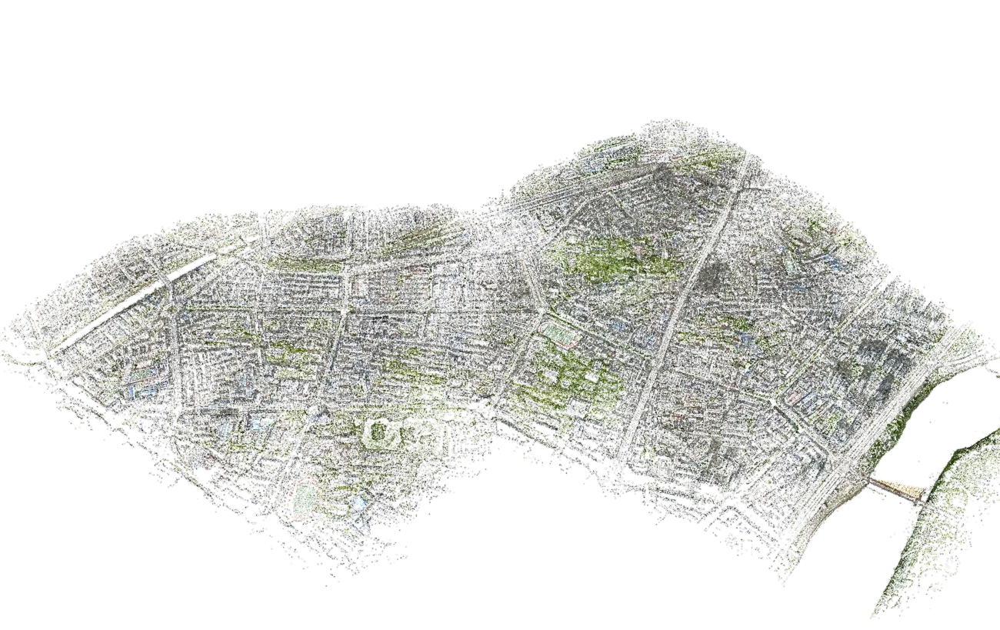
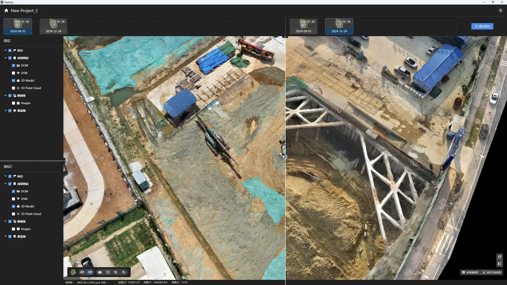
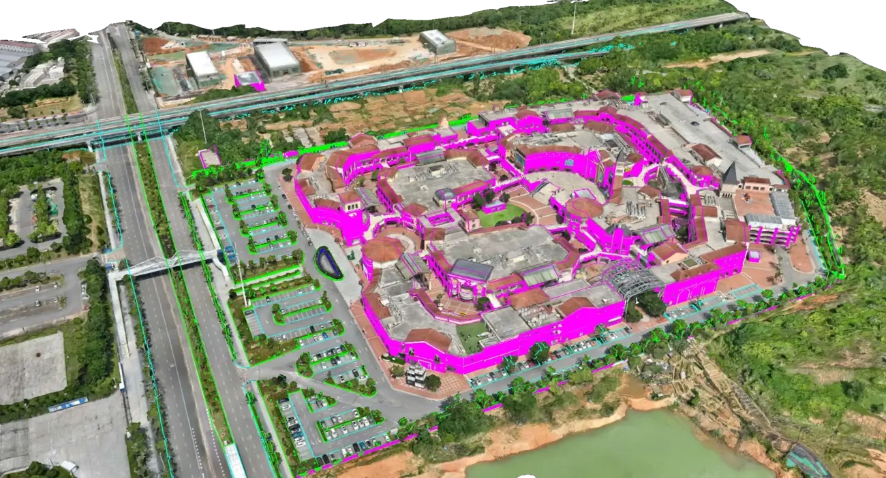
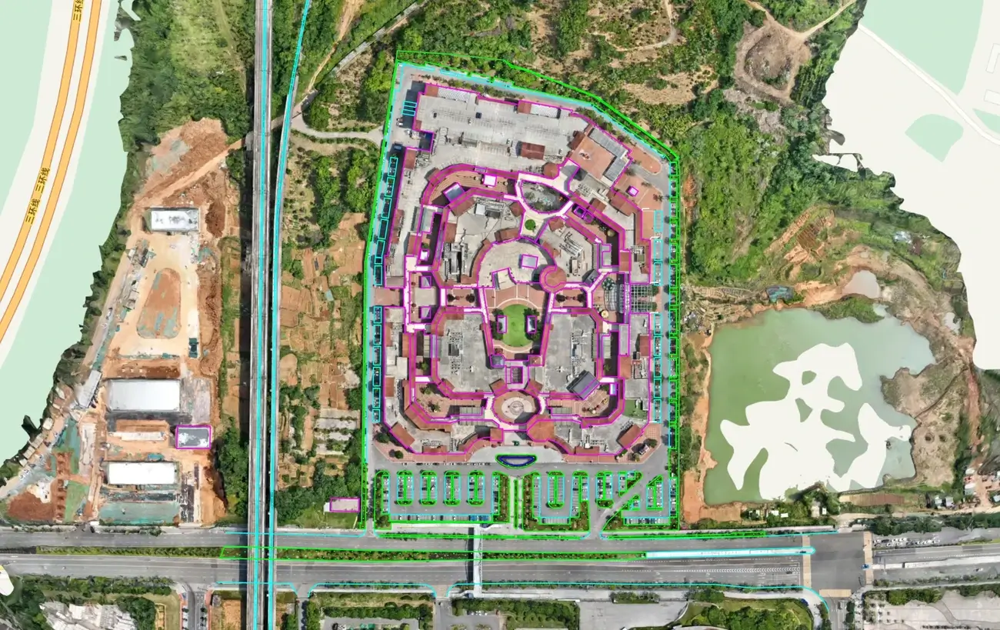
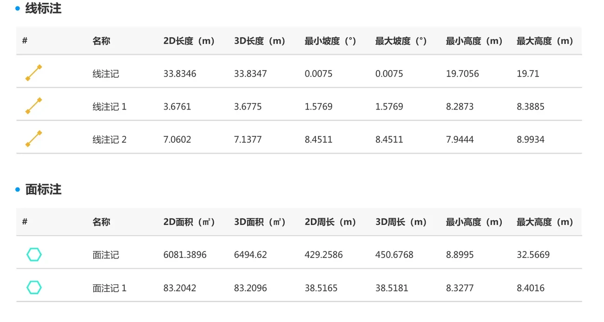
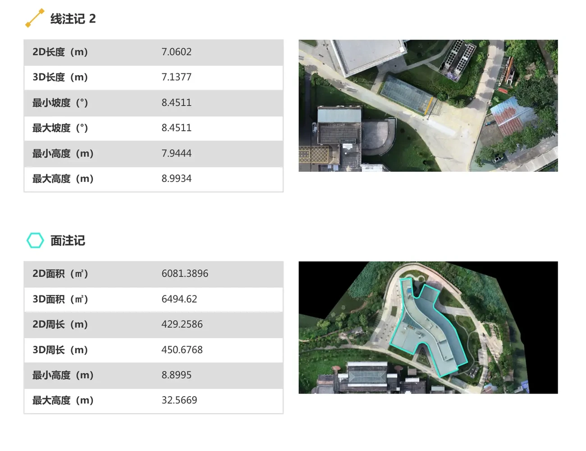

# 软件概述

想象一下：
- 工程师使用无人机航拍20分钟，借助MipMap软件完成三维重建，对照往期记录即可直观查看施工进展，关键数据可直接量测，实现资料全数字化存档。
- 测绘人员无需复杂配置与长时间专业培训，软件自动完成大部分参数配置，一键输出测绘级三维成果。
- 内容创作者可快速将实景素材转化为AR/VR、游戏所用的3D资源资产。

这就是 **MipMap Desktop**——不只是三维重建软件，更是助力用户生产提效、数字化转型的合作伙伴。

## 核心优势

### 支持多语言
**破除语言壁垒，全球用户无障碍使用**
MipMap Desktop内置12种操作语言，用户可使用母语操作专业摄影测量软件。
从软件界面到配套文档全链路多语言适配，消除专业软件的语言使用门槛。

### 操作简单
**极简交互设计，复杂技术落地轻量化**
传统航测软件依赖深厚专业功底与繁琐参数调试，MipMap Desktop依托智能算法自动优化处理流程：
- 智能相机标定：自动识别大疆相机内参，无需人工录入
- 自适应运算：根据数据源特征自动匹配最优处理方案

即便没有摄影测量专业基础，普通用户也可快速上手，产出合规的专业成果。

### 高性价比
**普惠定价，降低三维建模使用门槛**
对比同类专业软件动辄上万的年费，MipMap Desktop提供灵活订阅方案，中小企业、初创团队及个人用户均可低成本采购使用。

### 超高效率
**处理速度可达同类产品2～5倍，硬件适配门槛低**
普通游戏主机即可流畅运行：
- GPU：NVIDIA独立显卡，显存≥4GB
- 内存：≥16GB

自研优化版重建算法引擎，充分挖掘现有硬件性能，无需采购高端工作站即可快速生产成果。

### 智能优化
- 自动剔除动态地物：智能筛除画面内车辆、行人等移动干扰要素
- 智能匀光匀色：自动修正影像明暗、色彩不均问题
- 自适应分块：根据设备硬件配置自动拆分任务

## 三大核心应用场景
### 航测领域
**厘米级高精度成果输出**
自动解析大疆机型RTK/GPS定位数据，搭配地面控制点约束，可实现免像控或控制点辅助的厘米级三维重建。

**大疆设备无缝适配**
一键读取大疆无人机原始元数据：
- RTK定位坐标
- 相机内参
- 拍摄位姿信息
无需额外配置，照片直接导入即可启动解算。

**控制点智能管理**
- 智能辅助刺点：预判控制点点位，简化人工刺点作业
- 精度质检报告：自动生成控制点残差统计数据

**超大测区批量处理**
依托内存优化+智能分块技术，单台电脑可处理海量航拍数据（实测16GB内存支持60276张影像运算）：
- 智能内存管控
- 自定义任务分块
- 任务断点续跑

### AEC行业
**时序监测，施工变化直观对比**
独有时序项目管理体系，高效跟踪工程全周期施工进度：
- 时序项目分组：按施工周期归类多期任务，简化项目统筹
- 卷帘对比工具：内置画面卷帘，多期实景数据差异化比对

**CAD图纸叠合，实景对照设计图纸**
支持DWG、DXF等主流设计图纸导入：
- 设计图纸与实景三维叠加展示
- 快速排查现场施工偏差
- 实景模型融合设计方案可视化

**智能标注与量测，提升协同效率**
全功能标注测量工具：
- 点标注：标记特征点位，测量坐标
- 距离测量：精准测算线状地物长度
- 面积测算：自动统计闭合区域投影与曲面面积
- 体积测算：精准核算土方挖填方量

**一键导出专业成果报告**
批量汇总标注、量测数据，自动生成PDF成果报告，用于：
- 工程进度汇报
- 质量缺陷存档
- 项目资料归档

### 内容创作
**多终端数据源兼容**
除专业工业无人机外，日常设备拍摄素材均可接入：
- 手机实拍：适配手机影像
- 单反相机：支持大画幅照片导入，无需配套GPS定位数据
- 视频抽帧：自动从航拍视频抽帧

**原生适配游戏引擎生产**
针对游戏、VR/AR内容定制输出参数：
- 智能减面：精简模型面片，保留视觉效果
- 纹理压缩：优化贴图存储空间
- 多级LOD：自动生成多细节层级模型
- FBX/OBJ通用格式：成果直接对接主流3D制作、游戏开发软件

## 三步快速开始
**①安装软件**
下载安装包，一键静默安装。

**②导入数据**
导入照片文件夹，软件自动识别相机参数。

**③启动重建**
选定所需成果格式，点击开始，等待软件自动输出成果。

操作简便，三步即可完成建模。

---

## 立即体验
**15天全功能免费试用**
无功能阉割，解锁全部旗舰功能。

**配套免费学习资源**
- 官方操作手册
- 配套练习样例数据

**专属技术支持**
- 邮件答疑服务

[立即下载试用](https://www.mipmap3d.com) | [查看相关视频](https://v.douyin.com/xTcj9VigAZs/)