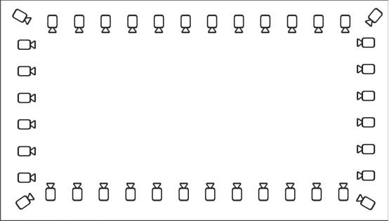
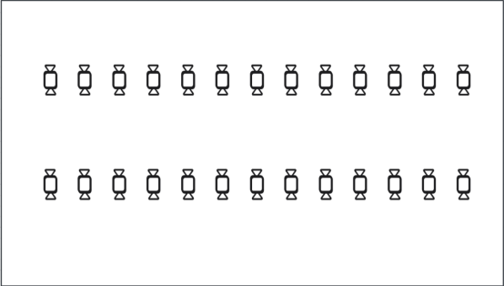
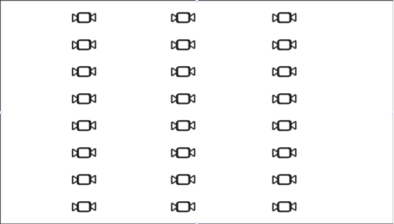
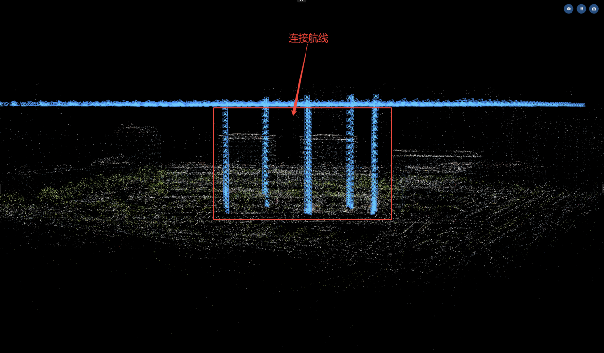

## 数据采集

**图像三维重建的质量主要取决于前期拍摄；遵循 "无模糊、高重叠、全覆盖" 的核心原则。**

### 设备选择与准备

| 设备类型                 | 适用场景                                 |
| ------------------------ | ---------------------------------------- |
| 手机、全景相机、单反相机 | 小物体、简单室内、室外场景、建筑细节补拍 |
| 无人机                   | 室外大场景、地形测绘                     |
| 激光雷达                 | 复杂室内、室外场景，空地融合             |

**拍摄前检查：**

-   擦拭镜头，确保干净无污渍；

-   摘掉镜头保护罩，避免产生光晕；

-   检查存储卡，确保有足够存储空间；

-   测试相机参数，确保曝光准确、对焦清晰。

### 关键拍摄参数设置

**重叠率（最重要参数）**

重叠率是指相邻两张照片中相同区域的比例，直接决定特征点匹配的成功率。

建议航线重叠度80%-90%，旁向重叠度70%-85%

**拍摄距离与分辨率**

投影像素大小 (GSD)：决定模型的精度和细节；

公式：GSD=(飞行高度 × 像素尺寸)/ 焦距。

-   小物体：拍摄距离 30-80cm，确保物体占画面的 70%-80%

-   室内场景：拍摄距离 1-3m，避免过近导致透视变形过大

-   航拍：根据所需精度确定飞行高度

**光照与环境控制**

- 室外：优先选择阴天或薄云天气，光照均匀、阴影柔和。

- 室内：光线尽量保证充足，多个不同角度照明，避免单一点光源。

**避免的光照问题**

- 强烈直射光：会造成高光区域细节丢失和阴影

- 光照变化：拍摄过程中避免阳光被云遮挡或太阳角度变化

- 逆光拍摄：会产生光晕和剪影，丢失物体细节

### 不同场景的拍摄技巧

**小物体拍摄（产品、手办、文物等）**

将物体固定在稳定平台上，采用螺旋环绕拍摄法：

-   水平方向：360° 环绕物体，每 10°-15° 拍摄一张

-   垂直方向：分 3-5 层拍摄 (俯角 30°、水平、仰角 30° 等)

-   最后从正上方和正下方各拍几张

保持相机与物体距离恒定，避免忽远忽近。对关键细节区域 (如雕刻、纹理) 进行近距离补拍

**室内场景拍摄（房间、展厅等）**

室内采集以绕墙环绕+井字路线+天花板/地面采集为主

1、绕墙环绕：沿着墙走，镜头朝外。

2、井字路线：在房屋中间画井字线路。（具体间隔密度依情况而定）

3、天花板：将相机翻转朝向天花板和地面，沿着上述采集路线重走一遍。

**户外大场景/航拍**

正射拍摄：

相机云台朝下，用规则网格航线覆盖整个区域

-   航向重叠率 80%，旁向重叠率 70%

-   飞行高度保持一致，避免频繁升降

倾斜拍摄：

增加 30°-60° 的倾斜航拍，捕捉建筑立面细节

-   倾斜拍摄时重叠率建议：航向≥85%，旁向≥80%

多高度拍摄：

-   高空：保证大范围整体结构

-   中空：用于主体建筑建模

-   低空：补充立面细节和关键区域

-   地面补拍：航拍完成后，用全景相机或手机对建筑底部、遮挡区域进行地面环绕补拍

**空地融合**

**关键点：需要采集从地面到空中的过渡影像，用于连接空中与地面。**

-   采集准备：选取四到五个空旷区域，均匀分布于测区内，作为无人机起降点，并规划手持设备整体采集路径，注意路径需包含对起降点的环绕采集。

-   空中采集：建议使用井字智能摆拍航线倾斜采集，旁向重叠度和航向重叠度均设置为85%。

-   地面采集：与手持设备常规采集方法相同，注意路径需包含对起降点的环绕采集。

-   连接航线采集：前往设置的起降点进行手动拍摄，从地面到航线高度，连续拍摄。将镜头对准远处空中倾斜摄影和地面设备都能看到的固定物体，相邻的照片重叠度不低于85%。

**常见错误与避免方法**

-   拍摄速度过快：导致运动模糊和重叠率不足，应缓慢移动相机

-   视角跳跃过大：相邻照片夹角超过 30°，导致特征点匹配失败

-   只拍一个高度：导致模型顶部或底部出现空洞

-   物体超出画面：导致边缘信息丢失

-   拍摄过程中改变焦距：导致尺度不一致，重建失败

-   忽略遮挡区域：应绕到遮挡物后面补拍缺失部分