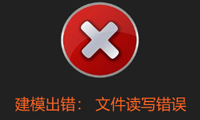
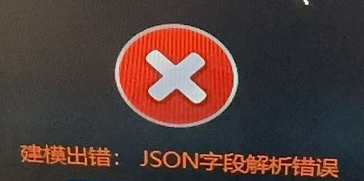
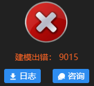
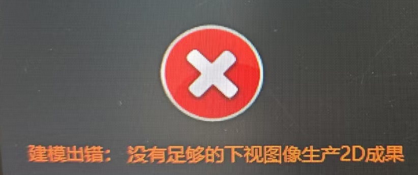

## 重建报错

**文件/照片读取错误**

解决方法：

-   检查照片位置是否移动，能否正常打开。

-   照片路径或名称不支持特殊字符，例如平方等。

-   直接从内存卡上读取，不稳定而且速度较慢，最好是把照片移动到本地磁盘建模。

-   可能图片有坏片，导致照片读取错误。

-   图像为4波段数据，软件暂不支持。

**空三注册失败**

原因：照片数量或重叠度不够，没有足够的特征点。

解决方法：重建需要大于10张且有多视角的照片，建议重叠度70%-80%。

**JSON字段解析错误、9015**

原因：导入的影像没有POS，成果设置了地理坐标系/投影坐标系。

解决方法：不设置坐标系或者设置本地坐标系。

**没有足够的下视图像生产2D成果**

原因：数据采集视角不是垂直下视，仅开启二维成果输出。

解决方法：同时勾选二维、三维成果生成，通过三维网格模型进行垂直下视投影，生成DSM与DOM。