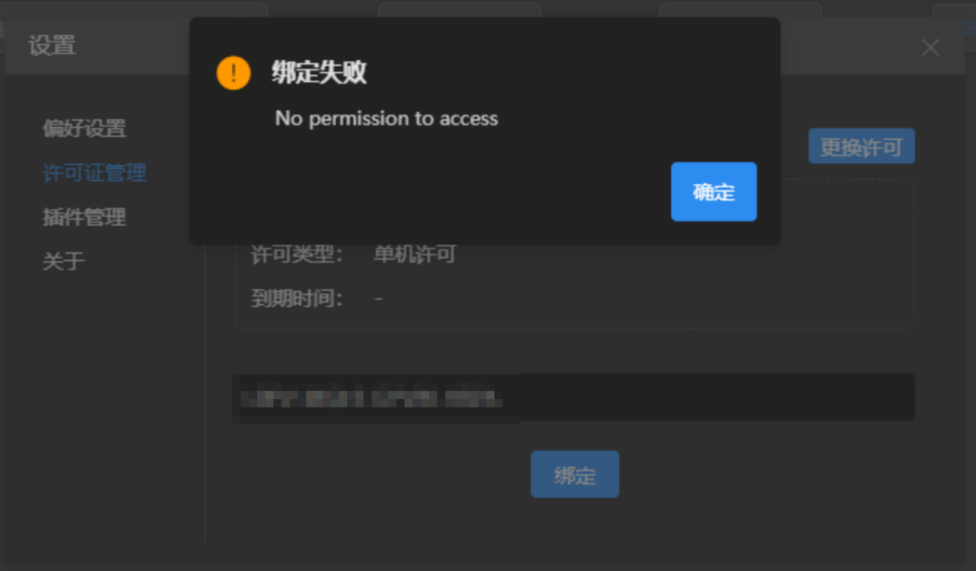

## 软件运行

**杀毒软件拦截安装**

原因：软件未签名的问题，官方渠道下载的软件本身不会携带任何病毒。

解决方法：将软件安装目录加入杀毒软件的信任区，如果文件已经被隔离，恢复隔离的文件。

**安装提示无法写入文件**

解决方法：以管理员身份安装。

**连接失败，VirBox未安装或未联网、网络或服务器异常**

解决方法：检查网络是否异常、查看VirBox软件是否安装并打开。

查看VirBox软件是否正常，手动启动virbox服务，如果异常可一键修复。

**许可绑定报错**

解决方法：检查是否有空格、多余字符或者不是同一个账号。