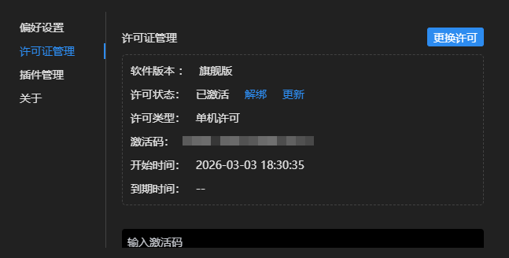
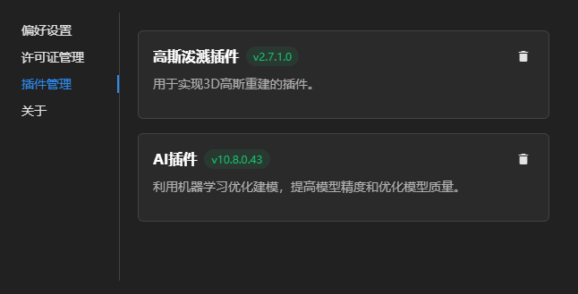
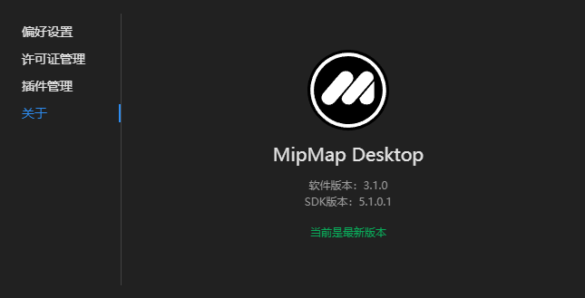

## 软件设置

点击进入用户设置面板。

### 偏好设置

- 工作目录：可点击修改图标，选择工程存放路径；勾选移动原工程文件，可将当前所有工程文件移动到指定路径。

- 地图服务：可切换工作底图，需联网才能加载显示。

- 长度单位：可切换长度单位。

- 面积单位：可切换面积单位。

- 体积单位：可切换体积单位。

- 保留去畸变影像：重建时生成的去畸变影像将被存储在工程目录/.temp/undistort文件夹里。

- 自动合并相机：可选允许/询问/拒绝；导入照片时，自动合并来自同一个相机的照片。询问只有当设备序列号、照片分辨率和焦距都一致才会自动合并。

- 用户体验改进计划：开启后，将向MipMap提供您的设备信息，以及必要的诊断和日志信息，帮助MipMap为您提供更好的用户体验和产品服务。

### 许可证管理

- 更换许可：可选择更换当前账号所购买的许可。

- 解绑：可解除当前设备的许可绑定，解绑后激活码可绑定到其他设备。

- 更新：更新当前许可状态信息。

- 输入激活码：可输入购买的激活码，点击绑定到当前设备。

### 插件管理

高斯泼溅插件：下载安装后用于生成高斯泼溅模型，可卸载。

AI插件：下载安装后用于提高模型精度和优化模型质量，可卸载。

### 关于

显示当前软件版本、SDK版本；若有新版本发布，可点击更新。

