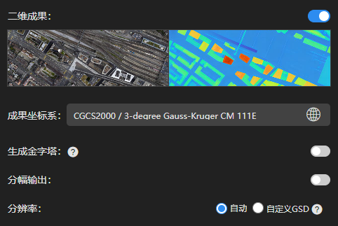
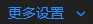

---
title: 二维成果
sidebar_position: 4
---
## 二维成果设置

### 二维成果

- 点击图标开启二维成果DSM与DOM输出。

- 仅开启二维成果输出，未开启三维成果输出。此时将基于 DSM进行逐像元微分纠正，生成DOM。
- 同时开启二维、三维成果输出。此时将利用三维网格模型进行垂直下视投影，生成DSM与DOM。

**注意事项：**

> 若导入的照片不包含位置信息，则无法开启二维成果输出。

> 若导入的照片采集视角不是垂直下视，需同时开启二维、三维成果。即可通过三维网格模型进行垂直下视投影，生成DSM与DOM。

### 成果坐标系

可选择二维成果的坐标系与高程系，可通过关键字搜索。若二维成果为自定义坐标系，则需导入prj文件。

### 更多设置

点击，可对成果进行自定义操作

- 生成金字塔：点击图标，开启金字塔输出。
- 分幅输出：点击图标，输入最大边长（单位为像素数)，DOM将按最大边长进行分幅输出。

- 分辨率：默认为。重建质量选超高，分辨率与GSD相近；重建质量选高，分辨率约为2倍GSD；重建质量选中，分辨率约为4倍GSD。
- GSD：点击，可输入指定的分辨率。设置过小的GSD时，实际成图的GSD会被限制在固定值。