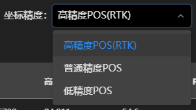
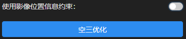
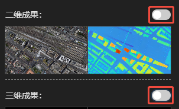
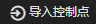
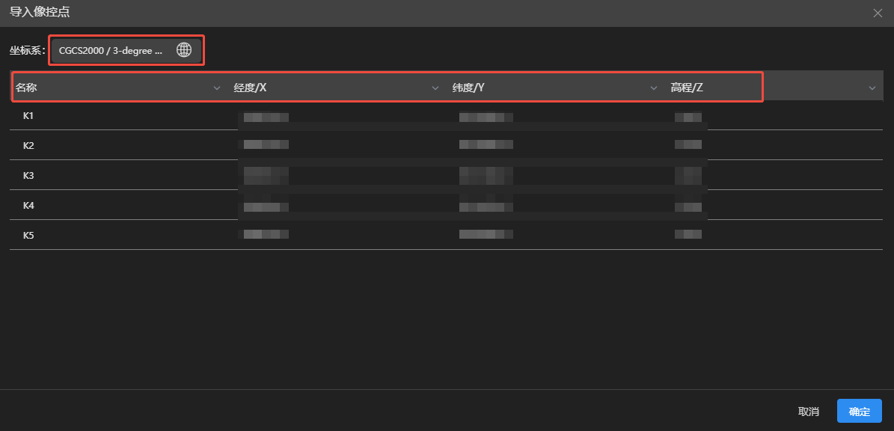
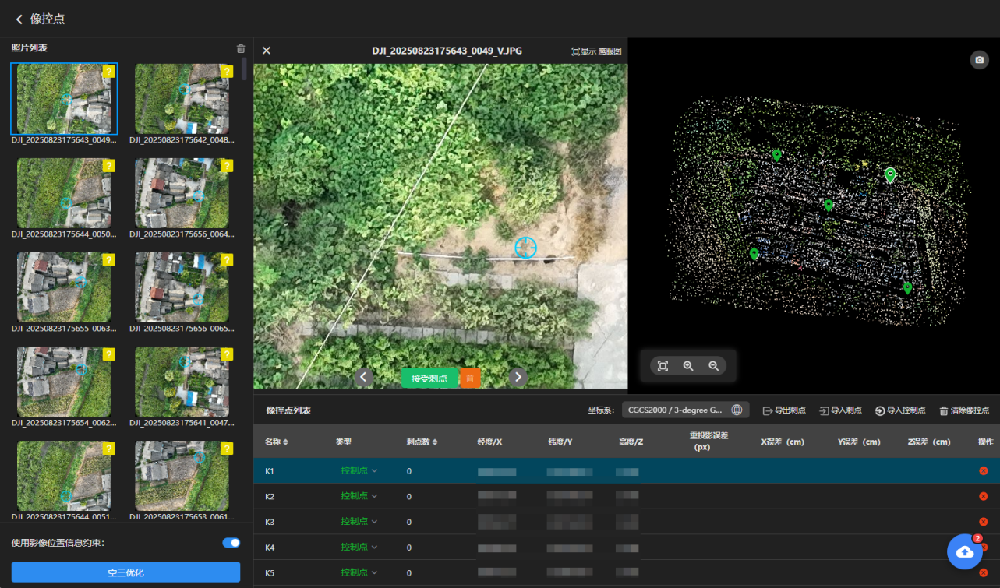
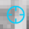
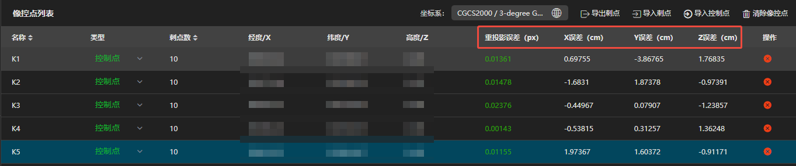

---
title: 空三设置
sidebar_position: 2
---
## 空三设置

### 像控点说明

**未设置像控点：**

二维、三维成果地理位置精度依赖于POS精度。若POS为高精度，则需将POS坐标精度改为高精度，增加POS的平差权重。

**设置像控点：**

- 二维、三维成果地理位置精度主要依赖像控点精度。

- 像控点数量、分布及测量精度会直接影响整体成果精度。

- 建议像控点均匀分布于测区边缘及内部，高差变化较大的区域应适当增加像控点。

- 当拥有高精度POS并且坐标系、高程系均与像控点相同时，可勾选使用影像位置信息约束，联合POS参与平差，以提高成果整体稳定性与绝对定位精度。

  

### 设置像控点步骤

①关闭二维成果、三维成果

②开始空三

③空三完成后，点击设置像控点

④导入控制点

选择控制点文件导入，选择控制点实际的坐标系与高程系，指定"名称、X、Y、Z"每列的表头。

⑤选择照片刺点

选择照片：

可用鼠标左键点击选择照片，表示该照片可能存在控制点。

刺点操作：

鼠标左键点击照片上的控制点位置即可完成刺点，若在控制点位置可点击完成刺点，可切换照片，可清除该照片刺点信息。

单个控制点刺点不少于 4 张照片，且照片尽量分布在不同航线 /视角、避开边缘。建议刺10张照片左右，保证足够重叠与交会强度。

像控点类型：

- 控制点：该点会参与空三优化，用来控制成果精度。
- 检查点：该点不会参与空三优化，用来检验成果精度。
- 禁用：该点无任何作用。

其他操作：

- 导出刺点：将当前刺点信息导出为json文件。

- 导入刺点：将刺点信息json文件导入到当前工程。

- 清除像控点：清除当前工程的所有像控点。

- 删除像控点：删除该像控点。

⑥空三优化

刺点完成即可开始空三优化。

使用影像位置信息约束：开启后，pos位置信息与控制点一起参与空三优化。只有pos与控制点的坐标系、高程系相同才开启。

⑦检查误差

检查空三优化后的重投影误差、X、Y、Z误差，均满足项目验收标准，即可进行成果重建。