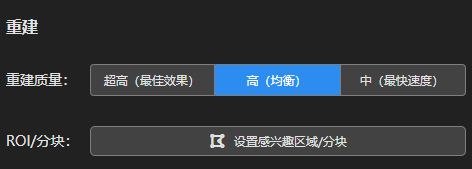
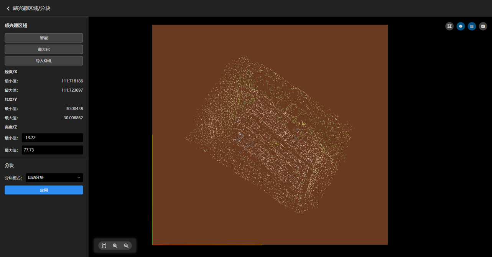
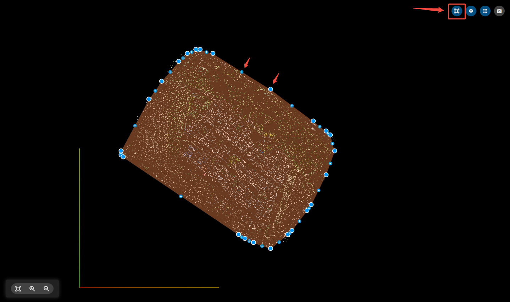
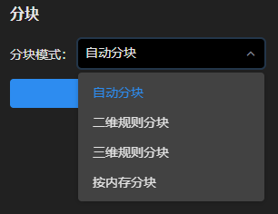

---
title: 重建设置
sidebar_position: 3
---
## 重建设置

### 重建质量

<table>
<colgroup>
<col style="width: 20%" />
<col style="width: 20%" />
<col style="width: 30%" />
<col style="width: 30%" />
</colgroup>
<thead>
<tr class="header">
<th>重建质量</th>
<th>超高</th>
<th>高</th>
<th>中</th>
</tr>
</thead>
<tbody>
<tr class="odd">
<td>渲染区别</td>
<td>原图渲染</td>
<td>
原图2倍间隔重采样渲染
</td>
<td>
原图4倍间隔重采样渲染
</td>
</tr>
<tr class="even">
<td>纹理与结构质量</td>
<td>超高</td>
<td>高</td>
<td>中</td>
</tr>
</tbody>
</table>

### ROI/分块

ROI指成果重建范围，软件默认为最大化ROI输出成果。若需要指定范围输出成果，可设置ROI/分块。

使用建议：若要将多个重建工程的三维成果拼到一起，则需要导入按分块生成的ROI（避免重复），使用二维规则分块，统一坐标系、分块原点、分块大小。

#### 设置感兴趣区域

- 智能：自动根据点云范围生成最小ROI。

- 最大化：自动生成最大ROI。
- 导入KML：将KML格式的ROI导入到当前工程。

- 手动编辑ROI：点击出现ROI所有节点，鼠标左键按住可拖动节点，鼠标右键点击可删除节点，鼠标左键点击可增加节点。
- ROI高度调节：可输入最小值、最大值调节ROI的高度范围。

#### 设置分块

- 自动分块：根据当前设备的内存大小自动分块。

- 二维规则分块：不考虑重建区域的高度信息，仅在XY平面按指定的格网坐标系进行规则分块。可按需设置格网大小，分块坐标系，坐标原点，点击应用生效。

- 重建完整块：若分块正好位于ROI的边界，则分块大小会被ROI切割。开启后会严格按照设置的格网大小进行分块输出。

- 分块信息：注意单个块最大使用内存不能超过当前设备的最大可用内存，否则可能会导致重建失败。

- 三维规则分块：考虑重建区域的高度信息，在XYZ三个方向按照指定的格网和坐标系进行规则分块。

- 按内存分块：指定每个分块占用的最大内存进行自适应分块。