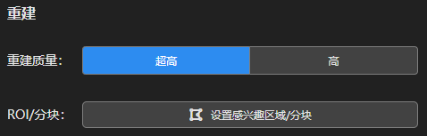
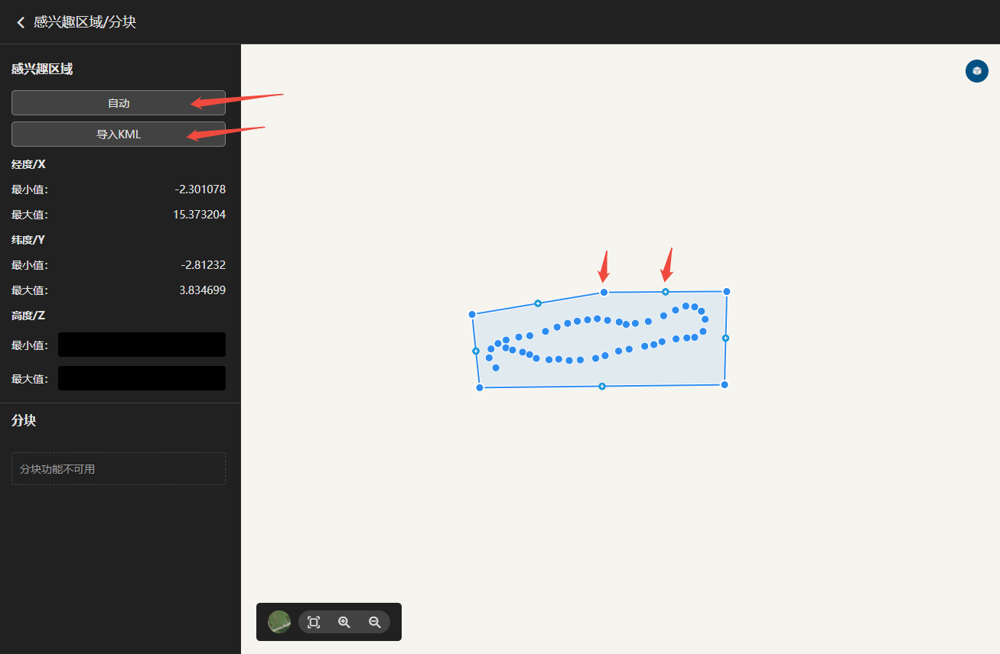
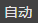

---
title: 重建设置
sidebar_position: 2
---
## 重建设置

### 重建质量

<table>
<colgroup>
<col style="width: 30%" />
<col style="width: 30%" />
<col style="width: 30%" />
</colgroup>
<thead>
<tr class="header">
<th>重建质量</th>
<th>超高</th>
<th>高</th>
</tr>
</thead>
<tbody>
<tr class="odd">
<td>渲染区别</td>
<td>原图渲染</td>
<td>
原图2倍间隔重采样渲染
</td>
</tr>
<tr class="even">
<td>纹理与结构质量</td>
<td>超高</td>
<td>高</td>
</tr>
</tbody>
</table>

### ROI/分块

ROI指成果重建范围，软件默认为最大化ROI输出成果。若需要指定范围输出成果，可设置ROI/分块。

### 设置感兴趣区域

- 自动：自动根据POS范围生成最大ROI。

- 导入KML：将KML格式的ROI导入到当前工程。

- 手动编辑ROI：点击出现ROI所有节点，鼠标左键按住可拖动节点，鼠标右键点击可删除节点，鼠标左键点击可增加节点。