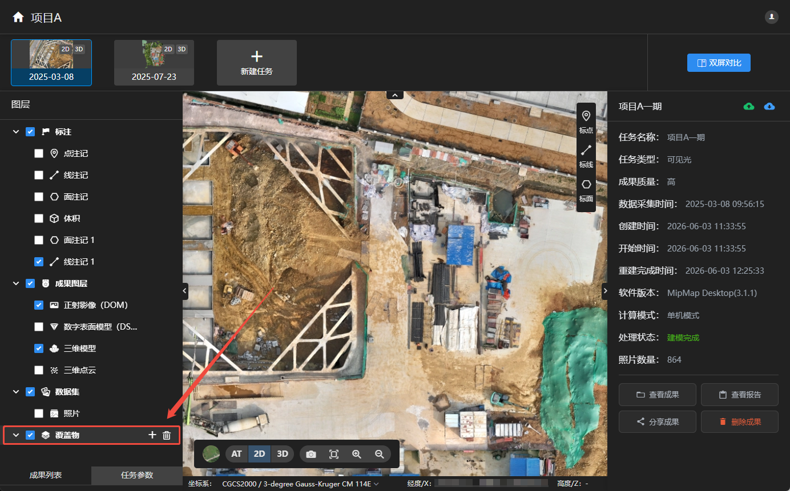
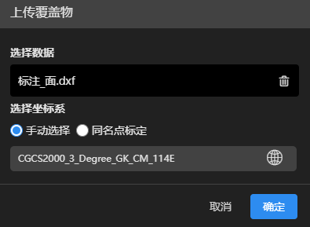
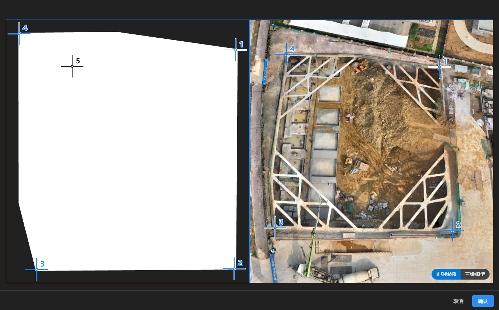
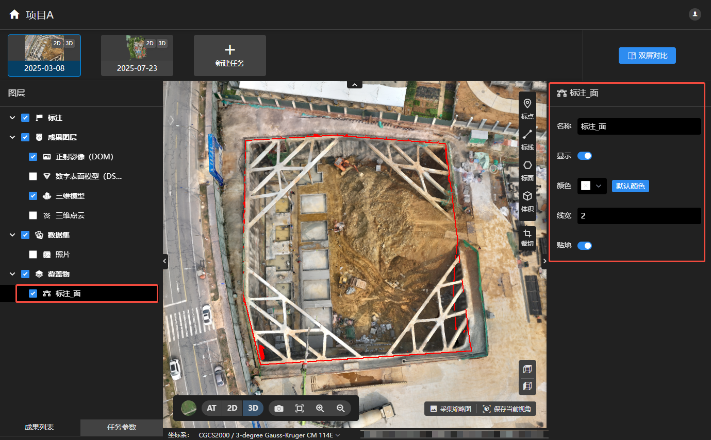

## 覆盖物

>导入覆盖物可将矢量数据叠加到二维、三维成果上，实现要素的可视化展示与空间分析。

### 导入覆盖物

点击选择覆盖物文件，添加至当前任务。

支持dwg、dxf、shp、GeoJSON格式的矢量文件。

可通过选择覆盖物的坐标系或通过同名点标定位置。

选择同名点标定，点击，进入标定界面

**操作步骤：**
- 右下角选择在正射影像或者三维模型上操作
- 鼠标左键在左侧矢量上点击同名点，然后在右侧成果上点击相同位置。
- 建议选择4个左右同名点，在矢量图内均匀分布。
- 标定完成后点击确认

### 覆盖物分析

- 导入成功后，可在二维或三维成果上查看覆盖物。

- 点击覆盖物，右侧可修改该覆盖物的名称、图层显隐、颜色、线宽。

- 开启贴地，覆盖物高度自动贴地；关闭贴地，可自由修改覆盖物抬升高度。

- 点击可删除当前任务所有/单条覆盖物。