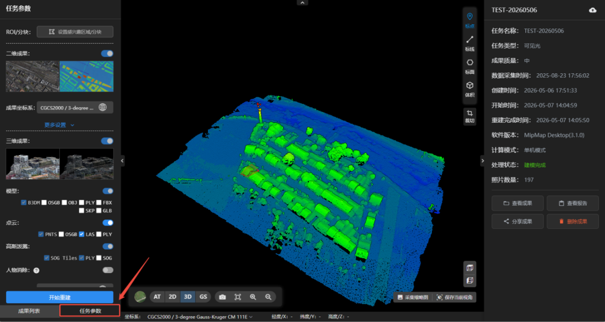

## 任务参数

点击任务参数，左侧面板会切换至任务参数选项。

**成果续建**

- 若成果格式漏选，可点击需要的格式，再点击开始重建即可在原成果上完成续建。
- 若未勾选的成果类型不可续建。例如：重建时未勾选模型，则不能选择模型成果续建。
- 若不可续建，可复制工程，再选择需要的成果格式，提交重建可跳过空三步骤。

**修改坐标系**

- 若坐标系选错，可重新选择坐标系，再点击开始重建即可快速转换成果坐标系。
- 若原始照片未提供pos位置信息，则不能修改坐标系。

