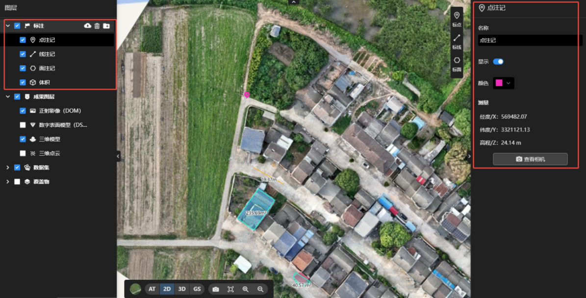
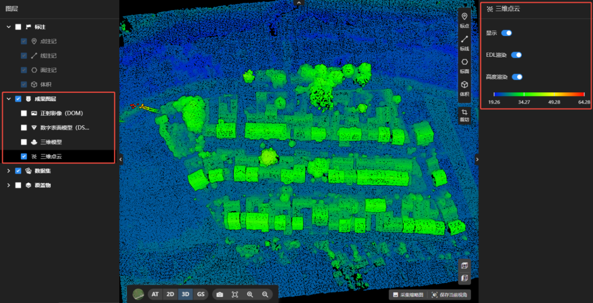
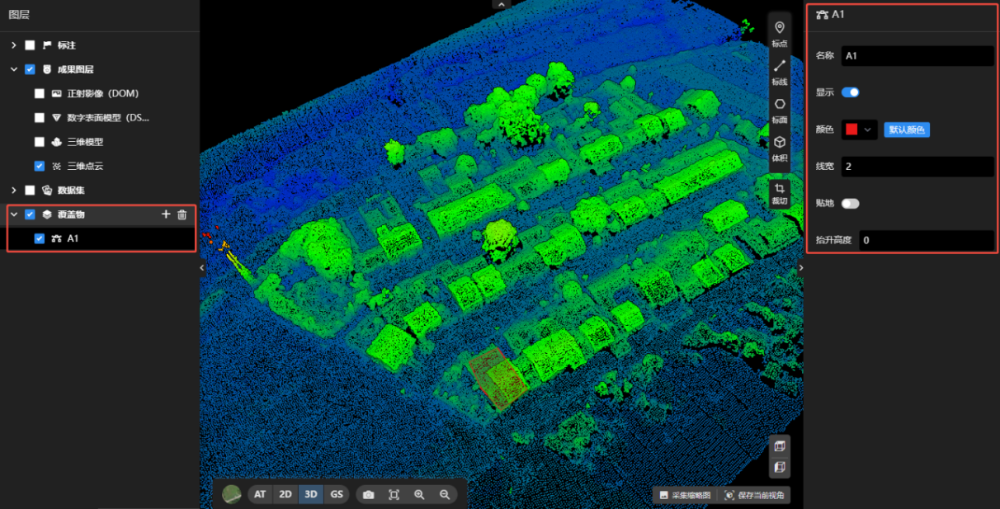

## 图层

**点击****可折叠/展开图层内容，点击****可显示/隐藏图层内容**

### 标注图层

：导出当前任务所有标注，可选择需要的格式与坐标系。

：删除当前任务所有/单条标注。

：创建文件夹，可将标注创建在文件夹中。

：缩放至该标注。

：修改该标注，可增加/移动节点。

：显示所有可见该标注的图像。

点击标注，右侧会显示该标注详细信息，可修改标注名称、颜色。

### 成果图层

点击不同成果图层，右侧可修改该成果图层的显隐，渲染方式。

### 数据集

可拖动值域条，控制地图中照片显示的大小。

### 覆盖物

：选择覆盖物文件，添加至当前任务。

：删除当前任务所有/单条覆盖物。

点击覆盖物，右侧可修改该覆盖物的名称、颜色、线宽，图层显隐。

开启贴地，覆盖物高度自动贴地；关闭贴地，可自由修改覆盖物抬升高度。

