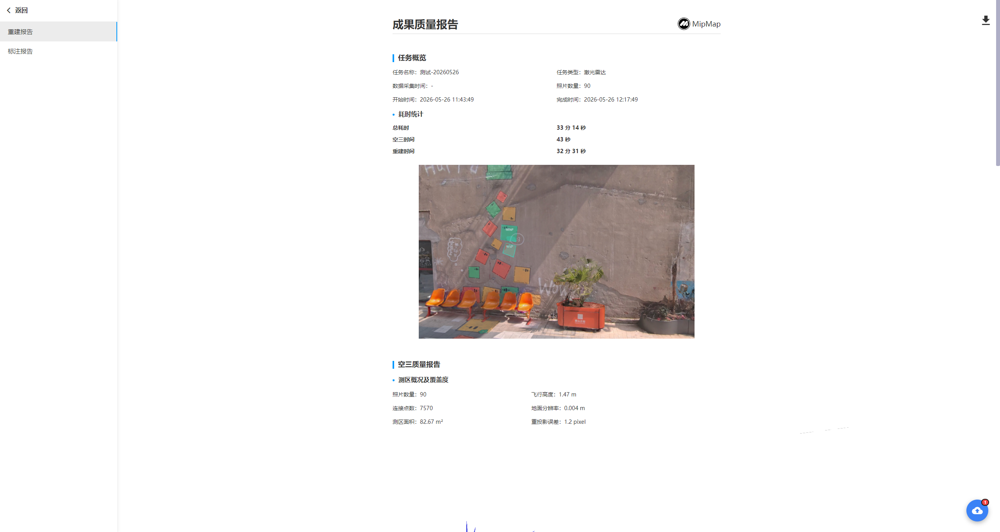

## 查看报告

点击查看报告，可以查看该任务的重建报告和标注报告，点击右上角可下载pdf格式的报告文件。

**重建报告记录测区的基本概况和任务重建参数信息；标注报告记录任务概览和标注列表与详情。**

名词解释：

- 重投影误差：误差越小，相机位姿越准确，空三精度和成果质量越好。一般在1pixel左右，大于2建议检查数据导入是否有误。
- 未入网照片和入网率：未入网照片指空三时未解算出相机位姿的照片。未入网照片越多，入网率越低，会导致成果有缺漏。
- 图像位置误差：指空三解算后的照片位置与原始pos提供的照片位置的中误差。该误差只作为参照，不能代表实际精度。
- 控制点和检查点：控制点用于空三绝对定向，误差越小精度越高。检查点用于验证空三精度，误差越小精度越高。

