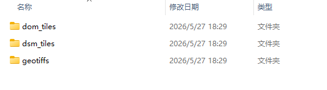
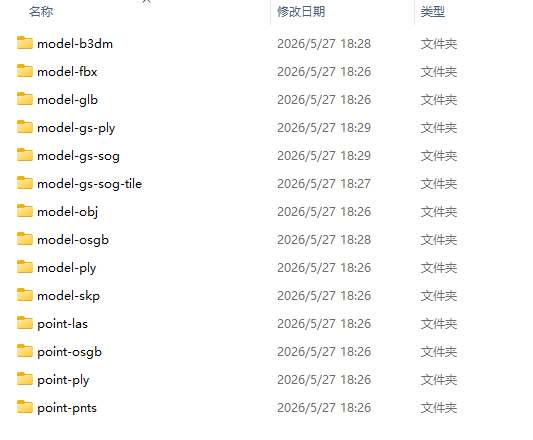

## 查看成果

点击查看成果，跳转至成果所在文件夹

2D：二维成果文件夹

-   dom_tiles：正射影像图切片成果

-   dsm_tiles：数字表面模型切片成果

-   geotiffs：正射影像图（DOM）、数字表面模型（DSM）等成果

-   split_dom：正射影像图分幅成果（需打开分幅输出）

3D：三维成果文件夹

-   model-b3dm：3dtiles模型成果文件夹

-   model-gs-ply：高斯点云ply成果文件夹

-   model-osgb：osgb模型成果文件夹

-   model-obj：obj模型成果文件夹

-   point-las：las点云成果文件夹

-   point-pnts：pnts点云成果文件夹......

AT：空三成果文件夹

logs：日志存放文件夹