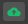
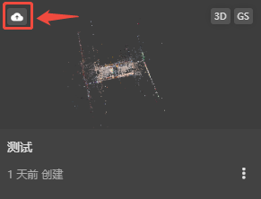
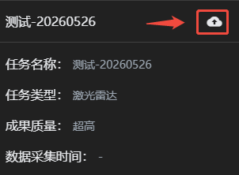

## 上传至云端

主界面可点击项目卡片左上角，成果界面可点击右上角，进入项目上传界面。

已上传的任务可点击，将覆盖更新已上传的任务。

下方进度条显示上传所占用的内存与云空间可用内存。
>若上传超过可用内存，则无法上传，需要购买云空间内存或清理云空间内存。

默认上传格式为：三维模型B3DM，点云成果PNTS，高斯成果SOGTiles，用于云端渲染浏览。

若需要上传其它格式，可点击自定义上传，选择需要上传的文件格式。

