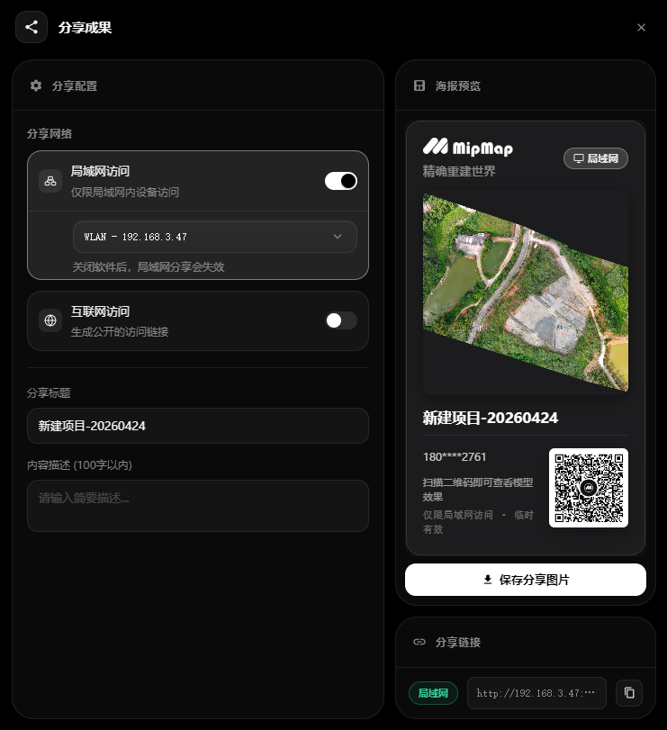

## 分享成果

已上传至云空间的成果可点击分享成果，可选择局域网分享或互联网分享。

### 局域网分享

- 点击开启局域网访问，选择连接的局域网，只有当前局域网内的用户可打开链接访问。
- 可修改分享标题，输入内容描述。
- 保存分享图片，可通过扫描图片中的二维码访问查看模型。
- 复制分享链接，可通过网页链接访问查看模型。
- 在该界面关闭局域网访问或关闭软件，分享即失效。

### 互联网访问

>分享前需阅读使用条款，悉知相关法律法规，禁止任何违法行为。
- 点击开启互联网访问，所有用户都可打开链接访问。
- 可修改分享标题，输入内容描述。
- 点击开启访问密码，可随机生成或设置六位密码，其它用户需要输入正确密码才能访问。
- 访问有效期默认为1天，可点击修改有效期。
- 保存分享图片，可通过扫描图片中的二维码访问查看模型。
- 复制分享链接，可通过网页链接访问查看模型。
- 在该界面关闭互联网访问或访问有效期过期，分享即失效。

