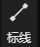
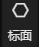
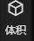
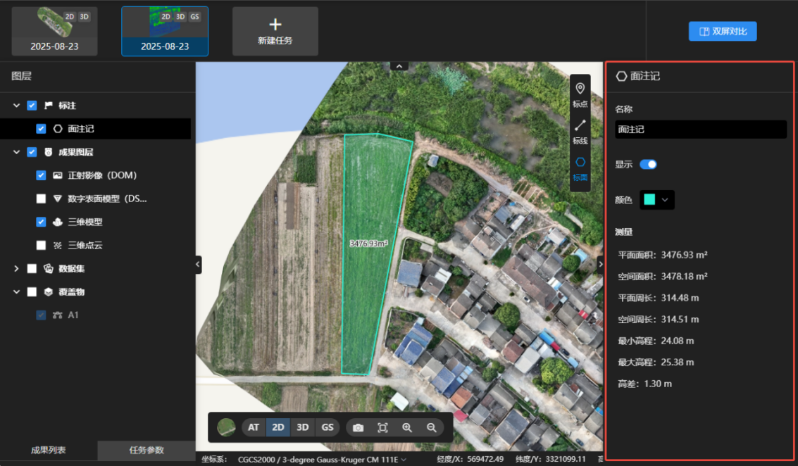

# 标注测量

重建完成后，可在地图上对二维、三维成果进行标注测量。

**注意**：只有包含位置信息的数据才能创建标注。若照片不包含位置信息，则只能查看成果，无法量测。

点击需要测量的内容：

- 可在成果上进标点、标线、标面、体积测量。
- 鼠标左键点击添加节点，鼠标右键点击回退节点，双击鼠标左键结束线段绘制，按ESC退出测量。
- 绘制完成后，右侧面板可显示标注测量的详细信息。
- 体积测量绘制完成后，需要选择拟合面，再点击计算体积，才会显示体积测量的详细信息。

