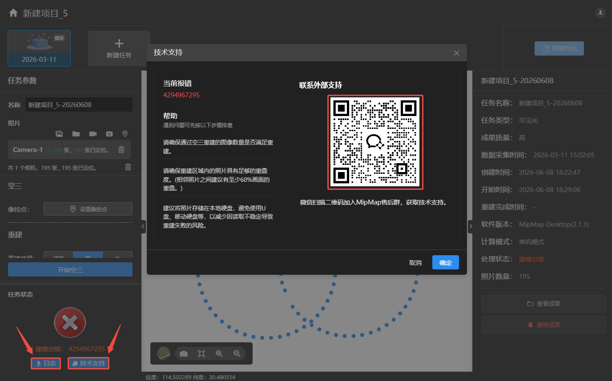
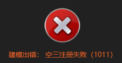

## 重建报错

>重建报错一般为数据或电脑运行环境及配置问题。出现报错首先检查导入的数据是否有误、电脑有无杀毒软件拦截以及配置是否满足重建需求。

以上都问题都排除，请点击，扫描二维码加入mipmap售后群，获取技术支持。

点击，可将日志文件导出，发送给技术支持以便分析重建报错原因。

### 照片读取错误

解决方法：

-   检查照片位置是否移动，能否正常打开。

-   照片路径或名称不支持特殊字符，例如平方等。

-   直接从内存卡上读取，不稳定而且速度较慢，最好是把照片移动到本地磁盘建模。

-   可能图片有坏片，导致照片读取错误。

-   图像为4波段数据，软件暂不支持。

### 空三注册失败

原因：照片数量或重叠度不够，没有足够的特征点。

解决方法：重建需要大于10张且有多视角的照片，建议重叠度70%-80%。

### 没有足够的下视图像生产2D成果

原因：数据采集视角不是垂直下视，仅开启二维成果输出。

解决方法：同时勾选二维、三维成果生成，通过三维网格模型进行垂直下视投影，生成DSM与DOM。